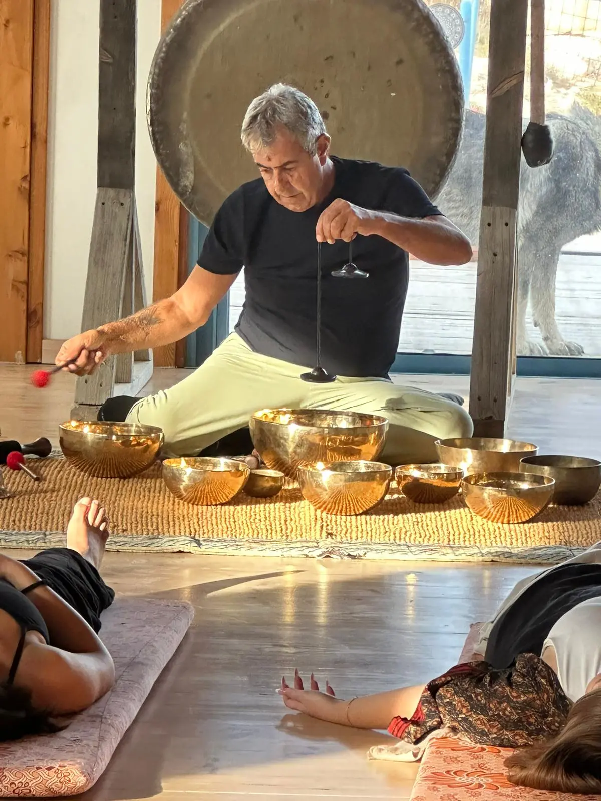

# Uri Shamai - Holistic Therapist

Welcome to the website of Uri Shamai, offering a range of treatments focused on touch and sound therapy for relaxation and balance.

## Table of Contents
- [About](#about)
- [Treatments](#treatments)
- [Contact](#contact)

---

## About
Uri Shammai is a qualified therapist, graduate of the Thai Kosmoi College of Alternative Medicine and Barak College. He offers a variety of treatments, including Sound Healing, Swedish Massage, Massage for Pregnant Women, Baby Massage, and Treatment with Crystals, among others.

### About Uri

---

## Treatments
Uri offers a variety of relaxing and balancing treatments, including:

- **Baby Massage**
- **Sound Healing**
- **Massage for Pregnant Women**
- **Cups**
- **Crystal Massage**

For more details and to make an appointment, visit the [Contact](#contact) section.

---

## Contact
- **Address:** Kibbutz Erez
- **Phone:** 0507431189
- **Email:** uriss100@gmail.com
- **Opening Hours:** Sunday-Thursday 9:00-17:00, Friday by appointment

---

For more treatments and details, [visit the website](https://yourwebsite.com).
